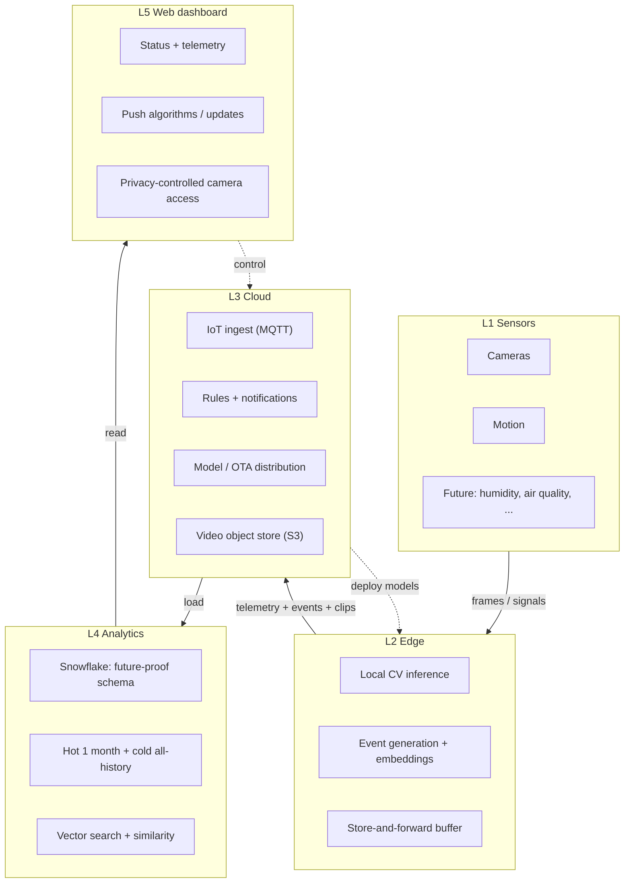

# Edge IoT platform - end-to-end architecture

A design for extending an existing edge IoT platform with a second edge device: local
computer-vision detection at the edge, telemetry and events streamed to a cloud IoT
hub, notifications on detection, long-term future-proof storage in Snowflake, and a
privacy-first web dashboard that also pushes new detection algorithms down to the
fleet.

This repository is the deliverable. It is diagram-heavy on purpose, and the SQL is
real and runnable. Read it top to bottom, or jump to a section from the map below.

## The problem in one paragraph

The core product is an IoT platform. Edge devices on site carry cameras and other
sensors and run local detection (person, PPE; extensible to fire and motion). On a
detection the platform notifies a human. Those humans use a web dashboard to watch
device status and near-real-time telemetry, enforce privacy-first access to camera
data, and push new detection algorithms and updates to devices with a click. All
telemetry and events flow to the cloud - AWS as the reference implementation, with the
design generalizing to any cloud - and land in Snowflake for long-term, future-proof
storage, analytics, and modelling.

The deployment I design for: **edge device 1** already on site with **3 cameras**, and
**edge device 2**, the new one, with **1 camera + 2 motion sensors**. Two devices with
different sensor counts and types - a heterogeneous fleet - which is exactly why the
schema has to be future-proof rather than rigid.

## System on a page

## How to read this repo

| Path | What it is |
|---|---|
| [`docs/01-architecture.md`](docs/01-architecture.md) | The five layers, the data-flow spine, and the generic-vs-AWS mapping |
| [`docs/02-edge-research.md`](docs/02-edge-research.md) | Pi + Coral vs Jetson with dated FPS/model numbers, the Arduino's role, motion-gating |
| [`docs/03-cloud-controlplane.md`](docs/03-cloud-controlplane.md) | Ingest (MQTT/X.509/QoS), notifications with debounce, staged model/OTA rollout |
| [`docs/04-snowflake-data-model.md`](docs/04-snowflake-data-model.md) | The centerpiece: registry vs append split, VARIANT, hot/cold, privacy, the extensibility test |
| [`docs/05-cost-estimate.md`](docs/05-cost-estimate.md) | Bottom-up monthly cost with stated assumptions and checkable arithmetic |
| [`docs/06-tradeoffs-failure-modes.md`](docs/06-tradeoffs-failure-modes.md) | What breaks when the internet drops, why each service, named limitations |
| [`docs/07-semantic-search-and-similarity.md`](docs/07-semantic-search-and-similarity.md) | Cosine-similarity search, near-duplicate suppression, and clustering, with the math |
| [`docs/08-aws-implementation.md`](docs/08-aws-implementation.md) | The real build: each AWS service and why, VPC/IAM/IaC, CI/CD, scaling, failure modes, runbook |
| [`docs/09-user-experience.md`](docs/09-user-experience.md) | The four roles, the permission matrix, and how a human uses it end to end |
| [`docs/10-production-engineering.md`](docs/10-production-engineering.md) | Rate limits, queues + DLQs, concurrency, idempotency, error handling, the algorithms in use, and the threat model |
| [`sql/`](sql) | Runnable Snowflake DDL: layered setup, registry, append tables, the ingestion pipeline, privacy policies + views |
| [`diagrams/`](diagrams) | All fourteen Mermaid diagram sources (`.mmd`), embedded inline in the docs above |
| [`prompts/`](prompts) | The prompt library used to structure this work - my engineering method, made explicit |

## Running the SQL

Run in order in a Snowflake worksheet:

| # | File | Creates |
|---|---|---|
| 1 | `sql/00_platform_setup.sql` | database, layered schemas, warehouses, resource-monitor caps, roles |
| 2 | `sql/01_registry.sql` | registry tables + `app_user` + `notification_rule` (+ seed rows) |
| 3 | `sql/02_events_telemetry.sql` | RAW landing + curated append tables |
| 4 | `sql/03_pipeline_streams_tasks.sql` | Snowpipe, streams, tasks, search optimization, materialized view |
| 5 | `sql/04_privacy_and_views.sql` | masking + row-access policies, audit, analytics views, worked examples |

- Steps `00` and `04` need an admin-capable role (creating warehouses, roles, policies).
- Step `03`'s Snowpipe block references an S3 stage + IAM role from the AWS layer
  ([`docs/08`](docs/08-aws-implementation.md)); skip that block to load the tables standalone.

## Assumptions

The brief said usage patterns are unknown and there are no non-negotiables, so the
judgement is mine to make and defend. I state every assumption here so a reviewer can
challenge each one directly. Cost-sensitive assumptions are re-derived in
[`docs/05-cost-estimate.md`](docs/05-cost-estimate.md).

**Deployment and tenancy**
- One site, single tenant today; the schema is tenant-scoped so multi-tenant later
  needs no migration. Modelling `tenant` now is free; retrofitting it later is not.
- Two edge devices now, with design headroom to roughly 20 without re-architecting.

**Users and roles (10 users, one customer)**
- Four roles: `admin` (full, plus user management), `operator` (config, push
  algorithms, view live/clip footage), `viewer` (dashboards and telemetry, no camera
  PII by default), `auditor` (read plus access logs, PII stays masked). Live-feed and
  unmasked PII are privileged by role - privacy-first, not open-by-default.

**Camera data (the hot/cold fork)**
- Raw video goes to S3, never Snowflake. Snowflake stores detection metadata and
  thumbnail/clip pointers. Hot tier is S3 Standard, 30 days immediately accessible;
  cold tier is Glacier Deep Archive, all history, retrievable in hours, with the
  `media_object` metadata row queryable in Snowflake forever.

**Volumes (assumptions, not measurements)**
- ~200 person/PPE detection events per camera per day (motion-gated) → ~800/day
  fleet-wide; ~2,000 motion signals/day; telemetry heartbeat every 30-60 s per device;
  ~3 GB video per device per day retained 30 days hot.

**Latency budgets**
- Edge inference real-time at 15-30 FPS (Jetson) or motion-gated bursts (Pi + Coral).
- Detection to notification delivered end-to-end, p95 < 5 s.
- Safety-critical (fire) local alarm at the edge < 1 s, independent of the WAN.
- Dashboard telemetry refresh 1-5 s; Snowflake analytics freshness ~1-2 min micro-batch.
- Semantic search top-k < 300 ms over the hot month.
- Store-and-forward buffer survives a 24-72 h outage; events durable and ordered,
  telemetry droppable.

**Infrastructure**
- Single region (`us-east-1`); DR is a named limitation. Per-device X.509 certificates; MQTT QoS 1.
- Snowflake is organized in layers (RAW landing → CORE registry → EVENTS → ANALYTICS)
  with three isolated X-Small warehouses (load / BI / vector), 60 s auto-suspend, and
  a resource-monitor credit cap. Details in [`docs/04`](docs/04-snowflake-data-model.md)
  and [`sql/00_platform_setup.sql`](sql/00_platform_setup.sql).

## Non-negotiables I set for myself

The customer said they have none, so I chose these and defend each in
[`docs/06-tradeoffs-failure-modes.md`](docs/06-tradeoffs-failure-modes.md):

1. **Raw video never enters Snowflake.** Video to S3; Snowflake holds metadata and pointers.
2. **The edge keeps working when the link drops.** Local detection plus a bounded buffer.
3. **No PII in analytics tables without a masking policy.** Masked by default.
4. **Algorithm and firmware pushes are staged and reversible.** Canary, rollout, rollback.
5. **Every layer boundary is versioned.** Old and new firmware both keep speaking to the cloud.

## Where the effort went, and why

I weighted the work by what the brief emphasized, not evenly:

| Signal the brief emphasized | Where it is answered |
|---|---|
| Model data that survives new sensors and devices | [`docs/04`](docs/04-snowflake-data-model.md) + [`sql/`](sql) - the centerpiece |
| Understand the edge/cloud division of labour | [`docs/02`](docs/02-edge-research.md) + [`docs/01`](docs/01-architecture.md) |
| Design for failure, not just the happy path | [`docs/06`](docs/06-tradeoffs-failure-modes.md) |
| Respect cost at a small company | [`docs/05`](docs/05-cost-estimate.md) |
| Treat privacy as architecture | [`sql/04_privacy_and_views.sql`](sql/04_privacy_and_views.sql) + [`docs/04`](docs/04-snowflake-data-model.md) |
| Analytics and modelling depth | [`docs/07`](docs/07-semantic-search-and-similarity.md) |
| Actually buildable on real infrastructure | [`docs/08`](docs/08-aws-implementation.md) - services, IaC, CI/CD, runbook |
| How a human actually uses it | [`docs/09`](docs/09-user-experience.md) - roles, journeys, permissions |
| Production-grade: limits, queues, resilience, security | [`docs/10`](docs/10-production-engineering.md) - rate limits, DLQs, idempotency, algorithms, threat model |

The centerpiece answer, in one line: **adding a humidity sensor next year is one row in
`sensor_type` and one in `sensor` - zero DDL, zero migration.** The worked example is at
the bottom of [`sql/04_privacy_and_views.sql`](sql/04_privacy_and_views.sql).
