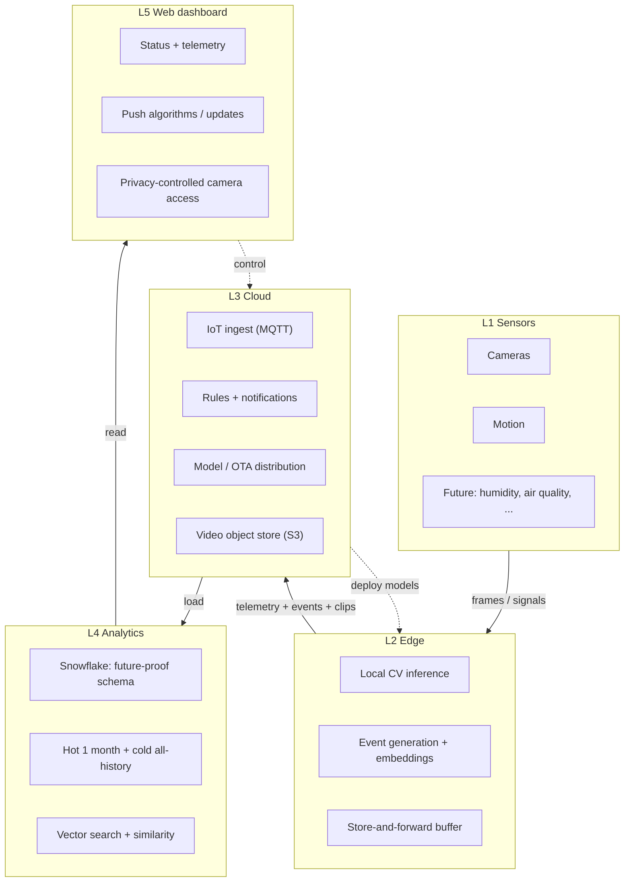
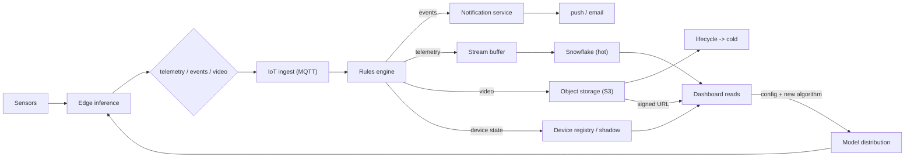
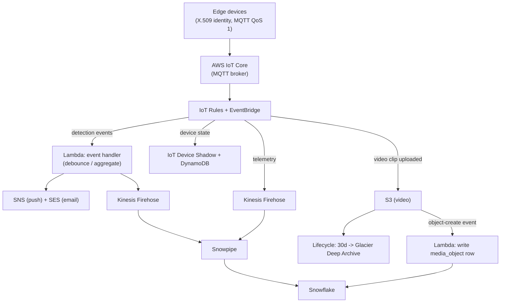

# 01 - Overall architecture

**Guiding rule: keep the interface between layers stable even as the insides change.**

That is what "future-proof" means in practice:
- Old-firmware and new-firmware devices both speak to the cloud.
- A new sensor type lands as a row, not a migration.
- A new model ships without touching the ingest contract.

## System on a page

Solid arrows are data flowing up; dashed arrows are control flowing down. The two
directions are the two halves of the platform: a **data plane** (sensor to
warehouse) and a **control plane** (dashboard to device).

## The data-flow spine

**The key structural choice: a three-way fan-out at the rules engine.** Each stream
takes a different path because they differ in shape, volume, and cost. Collapsing them
into one pipe is what makes an IoT platform expensive and slow.

| Stream | Character | Path |
|---|---|---|
| Events | Small, urgent | Notify a human (debounce -> push/email) |
| Telemetry | Small, steady | Buffer -> load -> analyze in Snowflake |
| Video | Large, expensive | Object storage, tier aggressively, never into the warehouse |

## Cloud ingest detail

Detail on identity, QoS, notification debounce, and the rollout mechanism is in
[`03-cloud-controlplane.md`](03-cloud-controlplane.md).

## Generic or AWS: presenting both

**Both columns is the answer** - it shows the pattern, not just one vendor's brand names.
AWS is the reference (first-class managed IoT stack); the self-hosted column proves
nothing here is a lock-in I could not escape.

| Generic component | AWS reference | Self-hosted alternative |
|---|---|---|
| Device connectivity / IoT hub | AWS IoT Core | Mosquitto / EMQX MQTT broker |
| Rules / event routing | IoT Rules + EventBridge | Kafka + a consumer service |
| Stream buffer to warehouse | Kinesis Firehose + Snowpipe | Kafka + Snowpipe connector |
| Compute for handlers | Lambda | Containers on ECS / a VM |
| Object storage (video) | S3 + lifecycle policies | MinIO / any blob store |
| Notifications | SNS (+ SES for email) | A queue + a mailer service |
| Device registry / state | IoT Device Shadow + DynamoDB | Postgres + a state table |
| Model / OTA distribution | IoT Jobs + S3 artifacts | A signed-artifact CDN + agent |
| Auth | Cognito | Keycloak / Auth0 |
| Warehouse | Snowflake | Snowflake (it is the requirement) |

## The four zoom-ins, and where to find them

1. **Cloud ingest** - above, and [`03-cloud-controlplane.md`](03-cloud-controlplane.md).
2. **Control-plane loop** (push new algorithms) - [`03-cloud-controlplane.md`](03-cloud-controlplane.md)
   and diagram [`diagrams/04-control-plane-loop.mmd`](../diagrams/04-control-plane-loop.mmd).
3. **Data lifecycle** (hot/cold tiering) - [`04-snowflake-data-model.md`](04-snowflake-data-model.md)
   and diagram [`diagrams/05-data-lifecycle.mmd`](../diagrams/05-data-lifecycle.mmd).
4. **Semantic search / embeddings** - [`07-semantic-search-and-similarity.md`](07-semantic-search-and-similarity.md)
   and diagram [`diagrams/09-embedding-pipeline.mmd`](../diagrams/09-embedding-pipeline.mmd).

All fourteen diagram sources live in [`/diagrams`](../diagrams) as `.mmd` files and are
embedded inline in the docs that discuss them.
