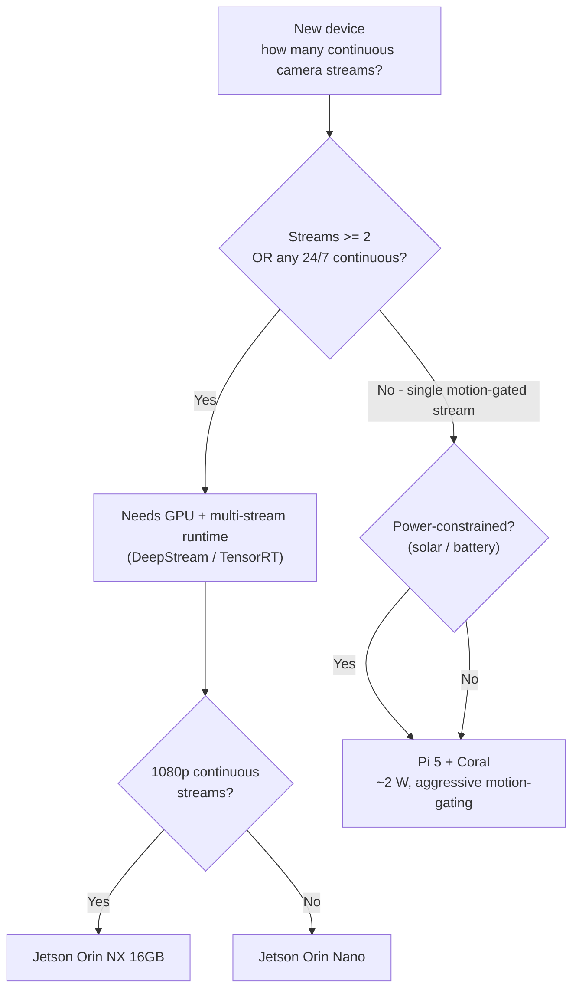

# 02 - Edge research: compute at the camera

**The on-device compute fork turns on frames-per-second per dollar and per watt — public, dated numbers (pulled July 2026).**

- Numbers-first by design: the whole hardware split is a benchmark decision.
- Every quoted figure names its source and pull date.
- Community-benchmarked or approximate values are marked as such and given as ranges, never false-precision.

## 1. The workload

**Both detections the platform cares about — person and PPE (hard hat, hi-vis vest, and their negatives) — are object-detection tasks: draw a box and label it, not classify the whole frame.**

**Model family**
- Standardizing on the Ultralytics YOLO single-stage detector family.
- Current mid-2026 releases are YOLO11 and YOLO26, but most open PPE data/tooling still targets YOLOv8 — so YOLOv8 is my sizing reference, newer heads are a drop-in upgrade (same export toolchain, same TensorRT path).
- Single-stage over two-stage (Faster R-CNN): on edge silicon, latency and memory budget beat the last point of mAP, and YOLO's speed/accuracy curve fits.

**Input resolution**
- 640x640 working resolution — native YOLO training res and the edge sweet spot.
- Dropping to 416/320 buys FPS but costs small-object recall; a hard hat at 15 m is a small object.
- Default 640 unless a camera's geometry forces 960, in which case FPS drops ~with pixel count and I re-check the budget.

**Model size (dated, per Ultralytics model docs / repo, July 2026):**

| Model    | Params      | Weights (FP32) | GFLOPs @640 |
|----------|-------------|----------------|-------------|
| YOLOv8n  | ~3.16 M     | ~6 MB          | ~8.7        |
| YOLOv8s  | ~11.17 M    | ~22 MB         | ~28.6       |

- INT8 quantization roughly quarters footprint again — mandatory on the Coral, and it shrinks OTA push size across the fleet.

### PPE: single combined model vs two-stage

PPE is not a stock COCO class — COCO gives `person` free but knows nothing about hard hats. Two ways to do it, both of which I have used:

| Approach | How | Pros | Cons |
|---|---|---|---|
| **Single combined model (my default)** | One YOLOv8 detector trained on a PPE dataset that includes `Person` alongside safety classes (typical set: `Hardhat`, `NO-Hardhat`, `Mask`, `NO-Mask`, `Safety Vest`, `NO-Safety Vest`, `Person`, plus nuisance `machinery`/`vehicle` — per the widely used Roboflow construction-site PPE datasets, current 2026) | One forward pass gives person + PPE + explicit negatives; one predictable inference per frame regardless of crowd size; keeps FPS budget deterministic | Less per-person accuracy on crowded frames |
| **Two-stage (person detector -> PPE classifier on crop)** | Detect people with a stock person model, crop each box, run a lightweight PPE classifier per crop | More accurate per-person on crowded frames; version PPE logic independently | Second inference per detected person; complicates the latency budget |

- Default is the single combined model at the edge (deterministic FPS).
- Two-stage is the fallback if PPE false-negative rates (§5) prove unacceptable — a model swap, not an architecture change; the platform pushes models the same way either way.

## 2. The hardware fork

**Two credible edge stacks, and the fleet runs both. The dividing line: how many camera streams the node must keep up with, and whether it needs a GPU to do it.**

### The numbers (dated, sourced)

| Platform | Model / precision | Throughput | Source & date |
|---|---|---|---|
| **Jetson Orin Nano (Super)** | YOLO26n, TensorRT FP16 @640 | ~4.6 ms/im -> **~219 FPS** | Ultralytics Jetson benchmarks, Ultralytics 8.4.33 / JetPack 6.1, 2026 |
| **Jetson Orin Nano (Super)** | YOLO26n, TensorRT INT8 @640 | ~3.8 ms/im -> **~263 FPS** | Ultralytics Jetson benchmarks, 2026 |
| **Jetson Orin NX 16GB** | YOLO26n, TensorRT FP16 @640 | ~4.1 ms/im -> **~242 FPS** | Ultralytics Jetson benchmarks, 2026 |
| **Jetson Orin NX 16GB** | YOLO26n, TensorRT INT8 @640 | ~3.5 ms/im -> **~287 FPS** | Ultralytics Jetson benchmarks, 2026 |
| **Jetson Orin NX** | YOLOv8n, TensorRT INT8 @640 | **~60–65 FPS** | Peer-reviewed / Seeed benchmark, 2025–26 (older v8 head, heavier than v26n) |
| **Raspberry Pi 5 (CPU only)** | YOLOv8n @640, ncnn | **~12 FPS peak, ~2 FPS sustained** (thermal) | Community benchmarks, 2025 |
| **Coral USB Accelerator (Edge TPU)** | MobileNet v2 classification, INT8 | **~400 FPS** | Google Coral datasheet, current 2026 |
| **Coral USB Accelerator (Edge TPU)** | SSD-MobileNet v2 *detection*, INT8 | **~50–100 inf/s** (USB-bound, host-dependent) | Derived from Coral benchmarks; approximate — detection is heavier than classification |

**Reading these honestly:**
- Jetson 200+ FPS numbers are the nano model on a single-stream benchmark harness — not a promise of 200 FPS on three live 1080p streams. They signal headroom: an Orin Nano at 640 has ample compute to drive three cameras at 15–30 FPS each with GPU to spare for decode; DeepStream exists to multiplex several streams through one GPU.
- The Coral is a classification monster (~400 FPS MobileNet v2) but a modest detector: SSD-MobileNet detection lands in the tens-to-~100 inf/s range depending on host CPU and USB 3.0 vs 2.0. Marked approximate (host-dependent, no single authoritative page). Plenty for one motion-gated camera.
- The Pi 5 alone is the cautionary tale: ~2–12 FPS CPU-only for YOLOv8n, low end being sustained after thermal throttling. So the Pi in this fleet never runs vision on the CPU — the Coral always does the inference.

### The Arduino node's role

**A third compute tier deliberately does no vision: the Arduino-class microcontroller is the sensor/GPIO front end.**

- Sits on the motion sensors (PIR/radar), reads GPIO, debounces, emits a clean digital signal — "zone active" / "zone clear" — over serial/GPIO to the Pi or Jetson.
- No OS, no camera pipeline, no neural network — a rock-solid, microsecond-deterministic, low-power interrupt source, awake 24/7 for near-zero power.
- The vision SBC treats the Arduino signal as an input event — the enabler for §4 motion-gating: the always-on cheap thing watches, the expensive thing only then wakes and looks.

## 3. The design consequence for THIS deployment

**Both mapped devices fall out of the numbers cleanly.**

- **Edge device 1 — 3 cameras -> NVIDIA Jetson (Orin Nano, or Orin NX if streams are 1080p and continuous).** Three simultaneous streams need a GPU and a multi-stream runtime (DeepStream/TensorRT). A Pi+Coral cannot fan one Edge TPU across three continuous streams at 15–30 FPS each; a Jetson does it with headroom (see FPS table).
- **Edge device 2 — 1 camera + 2 motion sensors -> Raspberry Pi 5 + Coral USB TPU.** One motion-gated camera does not justify a Jetson's cost or power. The Pi handles orchestration, buffering, networking; the Coral does INT8 inference at ~50–100 inf/s (far more than a gated single stream needs); the two motion sensors (via Arduino/GPIO) gate it.

### Which hardware for a device?

**Architectural point: a heterogeneous fleet is the normal case, and the Snowflake schema already absorbs it.**
- A device row carries `hardware_model` (Jetson Orin Nano vs Pi 5 + Coral); a sensor row carries `type` (camera vs motion).
- Nothing hard-codes "a device has N cameras" or assumes one platform.
- So device 1 (3 cameras) and device 2 (1 camera + 2 motion) are the same schema with different rows — adding a fourth device of a fifth hardware type is data entry, not a migration.

## 4. Motion-gates-camera optimization

**Device 2's two motion sensors do more than log events: motion gates vision — the camera inference is woken by the Arduino "zone active" signal and idles otherwise.**

Economics are near-linear in zone-activity duty cycle:

- **Duty cycle:** a zone active ~10% of the day runs ~10% of the inference; the other 90% the Coral idles and the Pi does near-nothing but heartbeats.
- **Compute:** reclaim ~90% of inference cycles — spend it on a bigger model (YOLOv8s vs n) during bursts, or on thermal margin.
- **Power:** Coral draws ~2 W flat-out; idle 90% of the time is a real battery/solar/thermal win on a power-constrained node. The always-on watcher (Arduino + PIR) costs milliwatts.
- **Cost downstream:** fewer inferences -> fewer detection events, fewer clips to S3, fewer Snowflake rows. The cost model's ~200 events/camera/day already bakes in motion-gating; ungated 24/7 CV would multiply it.
- **Latency:** the tradeoff is a cold-start on the first frame after motion — paid once per burst. At PIR range that's tens of ms of lead time before a person is in frame, so it's free in practice. If it ever isn't, keep the pipeline warm a few seconds after the last motion rather than tearing it down.

- Motion sensors are a compute-scheduling input, not just telemetry. On the Jetson (3 continuous cameras) the idea applies more softly (gate per-stream on scene-change); the pure motion-gate is the device-2 win.

## 5. Edge cases and limits

**Concrete failure modes I design around, and where the hardware bounds the model choice.**

- **Thermal throttling.** Pi-5-CPU is the clearest case: ~12 FPS peak collapsing toward ~2 FPS sustained once the SoC throttles (community benchmarks, 2025). The Coral offloads that heat; the Jetson has its own version — Orin modules clock down without adequate heatsink/fan, so 200+ FPS lab numbers assume active cooling. Implication: budget FPS at the sustained/throttled number, not the datasheet peak, and put device temperature in the telemetry heartbeat.
- **Night / low-light accuracy.** Daylight-trained detectors lose recall in low light. Mitigation: IR illumination or IR-capable cameras plus low-light training examples. A data problem more than a compute problem, but it interacts with the model-size ceiling below.
- **Occlusion / crowding.** A single-stage detector misses partially occluded people on crowded frames, and a missed person is a missed PPE check — the main argument for the two-stage fallback (§1) on high-density scenes.
- **PPE false-negatives are a safety issue, not a metrics footnote.** A false positive ("no hi-vis" when there is one) is an annoying alert; a false negative (missing that a worker has no hard hat) is a compliance gap that defeats the system. I bias PPE thresholds toward recall (catch more, tolerate false alarms) and treat the explicit `NO-Hardhat`/`NO-Safety Vest` classes plus person jointly — an alert fires on "person present with missing PPE," more robust than inferring absence from a missing positive.
- **Model-size vs accuracy, bounded by the silicon.** On Pi+Coral the model must be INT8 and Edge-TPU-compilable — effectively capping around MobileNet-SSD / a quantized small YOLO. On the Jetson there's real headroom (YOLOv8n through s, even m, at real-time). So the Jetson node runs the more accurate model and the Pi node the leaner one — the heterogeneous fleet legitimately runs different-sized models against the same schema; the event payload is identical, only `hardware_model` and (optionally) `model_version` differ.

### What would flip my hardware choice

- **Device 2 grows past one continuous stream, or its camera goes 24/7 (motion-gating no longer applies):** Pi+Coral stops being enough and device 2 becomes a Jetson too.
- **A newer accelerator changes price/performance:** a Hailo-8/8L M.2 module or a Pi AI HAT gives ~an order of magnitude more headroom than the Coral for similar cost; if the fleet standardizes on one accelerator for supply-chain simplicity I re-run this table. The design does not care which accelerator wins — that's what `hardware_model` on the device row is for.
- **PPE recall proves inadequate at the required range/resolution:** move to 960 input or the two-stage model — both raise per-frame cost and can push a borderline node up a tier.
- **Power budget tightens (solar/battery node):** the calculus swings hard toward Coral's ~2 W and aggressive motion-gating, away from an always-on Jetson.

---

### Sources (accessed July 2026)

- Ultralytics — NVIDIA Jetson / DeepStream benchmarks (Ultralytics 8.4.33, JetPack 6.1):
  https://docs.ultralytics.com/guides/nvidia-jetson/ and
  https://docs.ultralytics.com/guides/deepstream-nvidia-jetson/
- Ultralytics — YOLOv8 model card (params / size / GFLOPs): https://docs.ultralytics.com/models/yolov8/
- Google Coral — USB Accelerator datasheet & Edge TPU benchmarks (MobileNet v2 ~400 FPS, ~2 W,
  4 TOPS peak): https://www.coral.ai/docs/edgetpu/benchmarks/ and the USB Accelerator datasheet.
- Seeed Studio / peer-reviewed benchmarks — YOLOv8 on Jetson Orin NX INT8 (~60–65 FPS) and
  Raspberry Pi 5 CPU/ncnn YOLOv8n (~2–12 FPS), 2025–2026.
- Roboflow construction-site-safety / PPE datasets — typical PPE class set including Hardhat,
  NO-Hardhat, Safety Vest, NO-Safety Vest, Person (current 2026).

Where a figure above is marked approximate or a range, it is because the value is genuinely
host- or thermal-dependent, or I could not tie it to a single authoritative page; I have
preferred a defensible range over a fabricated precise number.
