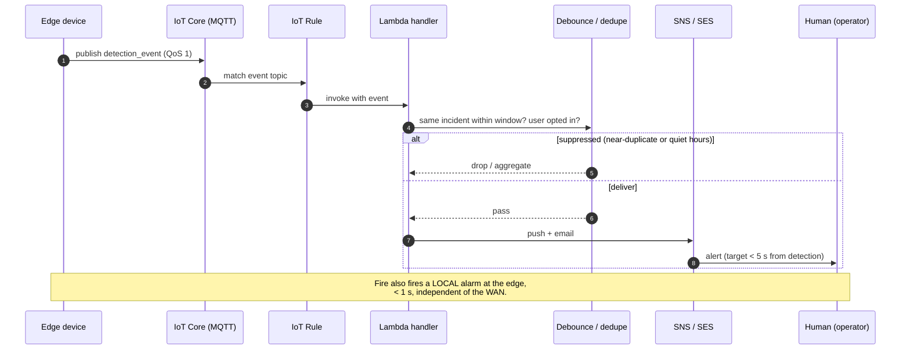
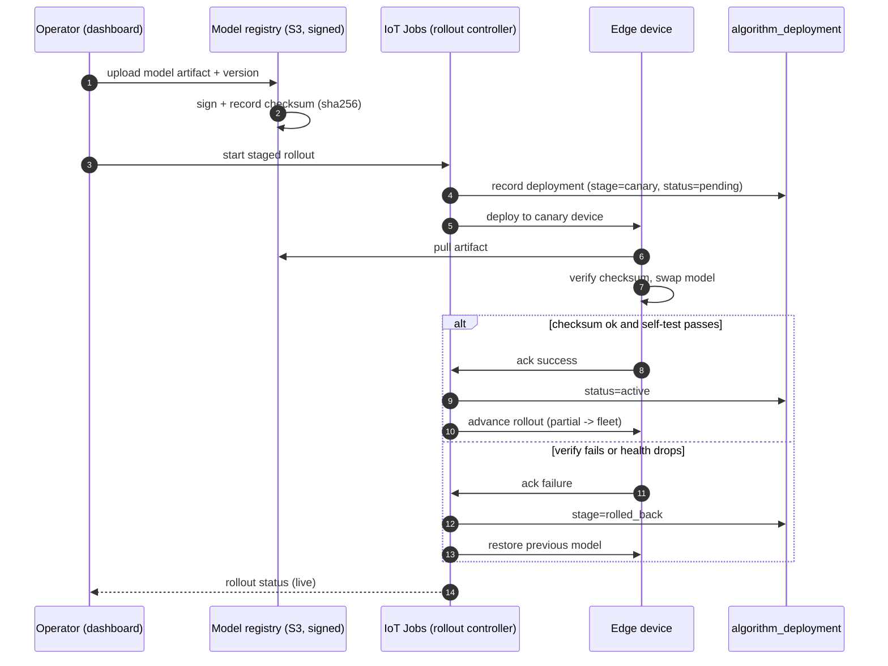

# 03 - Cloud, notifications, and the control plane

**Three flows define the cloud: data **in** (ingest), event to **human** (notification), model **out** to the fleet (control plane).** AWS is the reference implementation; generic mapping is in [`01-architecture.md`](01-architecture.md).

## 1. Ingest: device to cloud

| Aspect | Choice | Why |
|---|---|---|
| Transport | MQTT to AWS IoT Core | Small headers, pub/sub, built-in keep-alive doubling as heartbeat — right fit for constrained, intermittently-connected edge |
| Identity | Per-device **X.509 certificate** (CN = `device.device_uid`) | Not a shared key, so one compromised device is revoked on its own without re-keying the fleet |
| Topics | Split by shape: `telemetry/*`, `events/*`, `state/*` | Different consumers subscribe to different topics — keeps the three-way fan-out clean |
| Delivery | **QoS 1** (at-least-once), dedupe on client-generated `event_id` | Edge retries after a link drop, so duplicates are expected; a duplicate detection event is cheap, a lost one is not |
| Landing | Kinesis Firehose → Snowflake via Snowpipe micro-batch, ~1-2 min freshness | Warehouse is for analysis, not a real-time control loop |

## 2. Notification: event to human

- **Routing.** IoT Rule matches a detection event → EventBridge routes → Lambda handler decides and delivers via SNS (push) and SES (email).
- **User-configurable rules.** A dashboard rule table decides *which* events notify *whom* — fire always on, motion quiet-hours-only, PPE violations to the site supervisor. Policy is data, not code.
- **Debounce and aggregate.** Two layers stop a flickering detector sending 400 emails: edge-side near-duplicate suppression ([`07-semantic-search-and-similarity.md`](07-semantic-search-and-similarity.md)) collapses repeats into one incident; the cloud handler rate-limits and rolls up per (device, event_type) within a window. Failure mode is alarm fatigue — users muting the channel meant to keep them safe.
- **Latency budget.** p95 < 5 s end-to-end: edge detect + publish < 1 s, cloud rule + fan-out < 1 s, provider delivery 1-3 s.
- **Life-safety exception.** Fire fires a LOCAL edge alarm < 1 s, independent of the WAN — safety must not depend on the internet.

## 3. Control plane: dashboard to device

**The "push new detection algorithms with a click" requirement — drawn as its own loop because doing it *safely* is the point; a bad model pushed fleet-wide at once is a self-inflicted outage.**

- **Versioned, signed artifacts.** Model uploaded to an S3 registry, versioned, signed; `checksum_sha256` recorded in `detection_algorithm`. Device verifies checksum before swap — a corrupted or tampered artifact is never loaded.
- **Staged rollout.** Canary (one device) → partial (a fraction) → fleet, driven by IoT Jobs. Every step written to `algorithm_deployment`, so the schema can always answer "what is running where, and did it roll back?" Satisfies non-negotiable #4: no fleet-wide flash without a canary and a rollback path.
- **Rollback.** If checksum fails or device health drops post-swap, the device restores the previous model, acks failure, and the rollout stops itself.

**Model push vs firmware OTA** — same mechanism, different blast radius:

| | Model push | Firmware OTA |
|---|---|---|
| Frequency | Frequent, app-level | Rare, riskier |
| Worst case | Detects poorly | Bricks a device |
| Guardrails | Standard staged rollout | Smaller canary, longer soak, mandatory health gate before advancing |
