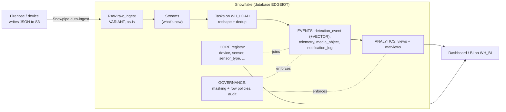
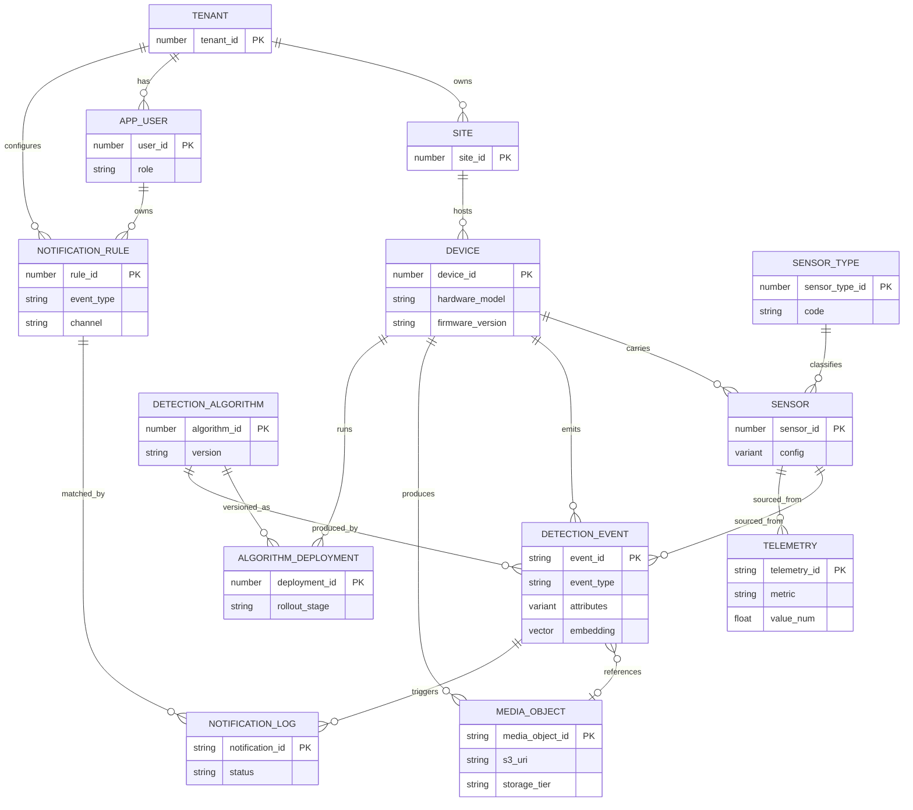
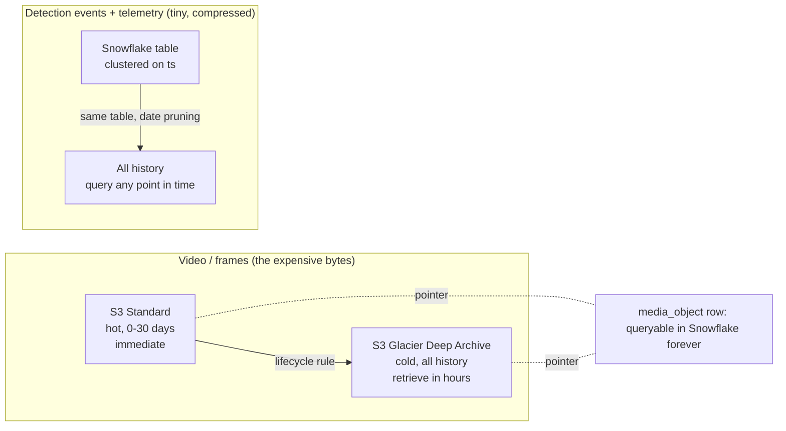

# 04 - Snowflake data model

This is the part I weighted most heavily. The brief asked for actual SQL and kept
returning to one word: *future-proof*. So the design goal is narrow and testable.

**In plain English:** I split the data into things that rarely change (which
device, which sensor, which model) and things that pour in constantly (detections,
readings, video pointers). I keep the pouring-in tables generic, so that adding a
new kind of sensor next year is a new *row*, not a database change. And I stage the
data in layers, so the messy outside world can never break the clean tables the
dashboard depends on.

The SQL is in [`/sql`](../sql), run in order:

| File | What it builds |
|---|---|
| `00_platform_setup.sql` | Database, layered schemas, warehouses, resource-monitor cost caps, roles |
| `01_registry.sql` | The registry (identity) tables + users + notification rules, with seed rows |
| `02_events_telemetry.sql` | RAW landing table + the curated append tables |
| `03_pipeline_streams_tasks.sql` | Snowpipe, Streams, Tasks, Search Optimization, a materialized view |
| `04_privacy_and_views.sql` | Masking + row-access policies, access audit, analytics views, worked examples |

## The one test the schema has to pass

> *"A humidity sensor is added to device 2 next year. What changes?"*

Correct answer: **one insert into `sensor_type`, one insert into `sensor`. Zero DDL.
Zero migration.** Readings flow into the existing `telemetry` table, and existing
dashboards pick them up automatically. If adding a sensor kind requires
`ALTER TABLE`, the schema has failed the only test that matters here. The worked
examples are at the bottom of `04_privacy_and_views.sql` and repeated below.

## The layered design (how data moves)

**In plain English:** data lands raw, gets cleaned on a conveyor belt, and arrives
tidy. Three benefits: nothing is lost if the belt stops, a new payload shape can
always land, and the cleaning logic lives in one place I can change safely.

- **RAW** - the landing zone. Snowpipe drops device messages here as-is, as JSON in
  a `VARIANT` column. Nothing is validated at the door. That is the point: a device
  on new firmware, or a brand-new sensor, always lands cleanly.
- **CORE** - the registry (identity that changes slowly).
- **EVENTS** - the curated, typed, high-volume tables.
- **ANALYTICS** - views and materialized views the dashboard reads.
- **GOVERNANCE** - the privacy policies and the audit trail, applied on top.

Separate **virtual warehouses** keep workloads from fighting each other: `WH_LOAD`
runs the conveyor belt, `WH_BI` runs the dashboard, `WH_VECTOR` runs heavy
similarity jobs. Each turns itself off after 60 seconds idle, and a **resource
monitor** caps the monthly credits so a runaway query cannot produce a surprise
bill (this is the guard for the top cost risk in [`05-cost-estimate.md`](05-cost-estimate.md)).

## The entity model

## Every table, in one line each

| Table | Layer | What it is (plain English) | Why it is shaped this way |
|---|---|---|---|
| `tenant` | CORE | The customer who owns the data | Present now though there is one customer, so multi-tenant later is free |
| `site` | CORE | A physical location | A tenant can grow to many sites without a schema change |
| `device` | CORE | An edge box (Jetson, Pi) | `hardware_model` + `firmware_version` make a mixed fleet a value, not a branch |
| `sensor_type` | CORE | The catalog of sensor *kinds* | The future-proof hinge: a new kind is one row here |
| `sensor` | CORE | A specific sensor on a device | `config` VARIANT absorbs per-type settings, no column per type |
| `detection_algorithm` | CORE | A versioned model artifact | What the dashboard pushes; carries checksum for safe rollout |
| `algorithm_deployment` | CORE | Which model runs where + rollout state | Lets the schema answer "what is running, did it roll back?" |
| `app_user` | CORE | A dashboard user + role | Drives privacy-first access; maps to Snowflake role + Cognito group |
| `notification_rule` | CORE | Who gets alerted for what | Notification policy is data, changed without a deploy |
| `raw_ingest` | RAW | Device messages as-is (JSON) | Schema-on-read landing zone; absorbs any new shape |
| `detection_event` | EVENTS | One row per detection | Typed common fields + `attributes` VARIANT + `embedding` VECTOR |
| `telemetry` | EVENTS | Generic numeric time series | `(sensor, metric, value)` fits every scalar signal, new metrics free |
| `media_object` | EVENTS | Pointer + metadata for a clip/frame | No pixels in Snowflake; the S3 bytes tier, this row stays queryable |
| `notification_log` | EVENTS | Every alert sent/suppressed | Proves a human was told; measures debounce |
| `access_audit` | GOVERNANCE | Who viewed which camera data, when | Privacy-first means provable access, not just restricted |
| `role_tenant_entitlement` | GOVERNANCE | Which role sees which tenant | Powers the row-access policy |

### The registry (slowly-changing spine)

`tenant -> site -> device -> sensor`, with `sensor_type` as a catalog off to the
side. Two decisions worth defending:

- **`tenant` exists even though there is one customer today.** Modelling it now is
  free. Retrofitting tenant isolation onto a single-tenant schema later means
  backfilling a column across every historical row and rewriting every query and
  policy. I would rather carry one unused column than pay that later.
- **`sensor_type` is a catalog, not an enum.** This is the future-proof hinge. A
  camera, a motion sensor, and next year's humidity sensor are all *rows*. Nothing
  about adding a kind of sensor touches DDL.

### The append tables (high-volume, generic)

Two schools of thought, and I use a deliberate hybrid:

- **Fully generic / EAV** - one `(sensor_id, ts, metric, value)` shape for
  everything. Flexible, but typed detection queries get awkward.
- **Semi-structured `VARIANT`** - Snowflake's superpower. A JSON-ish column queried
  with `payload:field::type` at read time. New sensor, new payload shape, no schema
  change. This is *why* Snowflake fits a future-proof IoT schema.

**The hybrid I chose:** `detection_event` types the fields every detection shares
(`device_id`, `sensor_id`, `ts`, `event_type`, `confidence`) **plus** a
`VARIANT attributes` column for the model-specific tail. Common queries stay fast;
the long tail stays flexible. `telemetry` is the generic numeric series.
`media_object` is a pointer only. When an access pattern stabilizes, I promote a hot
`VARIANT` path to a typed materialized view - schema-on-read first, optimize later.

`event_id` is client-generatable, so a device retrying after a link drop (MQTT
QoS 1 is at-least-once) does not create duplicate rows - consumers dedupe on it.

## How this scales (the engineering, not just the tables)

**In plain English:** the model is built so that "more devices" and "more history"
cost more storage but not more *rework*. Here is where each scale lever lives.

- **Micro-partitions + clustering.** Snowflake stores data in immutable
  micro-partitions and prunes them by min/max. Clustering `detection_event`,
  `telemetry`, and `media_object` on `TO_DATE(ts)` means a "last 30 days" query
  reads only the recent partitions, no matter how many years are stored. This is
  what makes the hot month fast while all history stays in the same table.
- **Separate warehouses.** Load, BI, and vector work run on their own engines, so a
  heavy analytics query never slows ingestion, and I size each independently.
- **Streams + Tasks.** The RAW-to-curated transform is incremental (a Stream only
  hands the Task the new rows) and serverless-scheduled (a Task runs only when its
  Stream has data), so an idle system spends nothing and a busy one keeps up.
- **Search Optimization Service** on `detection_event` makes point lookups ("this
  device's fire events") fast as volume grows, without a full scan.
- **Materialized views** pre-compute the daily rollups the dashboard shows most, so
  the common charts are instant and cheap; Snowflake keeps them fresh automatically.
- **Vector search stays exact** until roughly a million vectors, then an ANN index
  is the documented next step - see [`07-semantic-search-and-similarity.md`](07-semantic-search-and-similarity.md).

Nothing on this list requires reshaping a table. That is the whole point: scale is a
knob (warehouse size, clustering, search optimization), not a migration.

## Hot vs cold: reading F3.3 and F3.4 as two tiers, not one

"Camera data from the past 1 month immediately accessible" and "all historical data
available at any point in time" are **two service tiers**, and the split looks
deliberate.

| Data | Hot (immediate, ~1 month) | Cold (all history) |
|---|---|---|
| Detection events / telemetry | Snowflake tables, clustered on `ts` | **Same tables.** Structured data compresses tiny and stays hot indefinitely; date pruning keeps it cheap |
| Video / frames | S3 Standard, 30-day lifecycle | S3 Glacier Deep Archive; the `media_object` row stays queryable, only the bytes are archived |

The cost sentence I want the architect to hear: **Snowflake bills roughly flat per
compressed TB per month, so I keep structured events in Snowflake forever - they are
tiny - and I tier the one expensive thing, video, in S3, moving month-old clips to
Glacier while their metadata stays queryable in Snowflake.**

**One nuance:** "available at any point in time" is easy to misread as Snowflake
**Time Travel**. It is not. Time Travel is a recovery feature (undrop, as-of
queries) and extended retention adds storage cost. Long-term history here is just
rows that stay in the table. So I keep Time Travel at a modest 7 days for recovery
and rely on normal partitioned storage for history.

## Privacy is modelled, not described

Privacy was the word the customer repeated most, so it lives in the schema
(`04_privacy_and_views.sql`):

- **Dynamic data masking** on the S3 media pointer and the `attributes` VARIANT -
  masked by default, unmasked only for privileged roles. A viewer sees *that* an
  event happened, not a link to the footage.
- **A row access policy** (`device_tenant_isolation`) scoping rows to the caller's
  entitled tenant. The same query returns different rows per user, and onboarding a
  second tenant needs no query rewrite.
- **`access_audit`** - every signed-URL issue and every search writes a row.
  Privacy-first means *provable* access.
- Video reaches the dashboard only through **short-lived signed URLs**, never a
  public link; issuing one is an audited event. The full flow is in
  [`09-user-experience.md`](09-user-experience.md).

## Future-proofing, proven three ways

Each of these is data entry, not a migration. Full SQL is in `04_privacy_and_views.sql`.

1. **New sensor type (humidity).** One row in `sensor_type`, one in `sensor`.
   Readings flow into `telemetry` with `metric = 'humidity_rh'`. Existing dashboards
   that read telemetry by metric pick it up with zero change.
2. **New detection class (fire).** No schema change at all. `event_type = 'fire'`
   is just a new value in the existing `detection_event.event_type`; the
   model-specific details ride in the `attributes` VARIANT; a `notification_rule`
   row makes fire always page. The column never changes.
3. **New device with a new hardware type.** One `device` row with a new
   `hardware_model`. The heterogeneous-fleet design already handles it; the edge
   research in [`02-edge-research.md`](02-edge-research.md) explains why mixed
   hardware is the normal case.

That is the schema doing its job: the shape absorbs the future, so the team spends
its time on the product, not on migrations.
