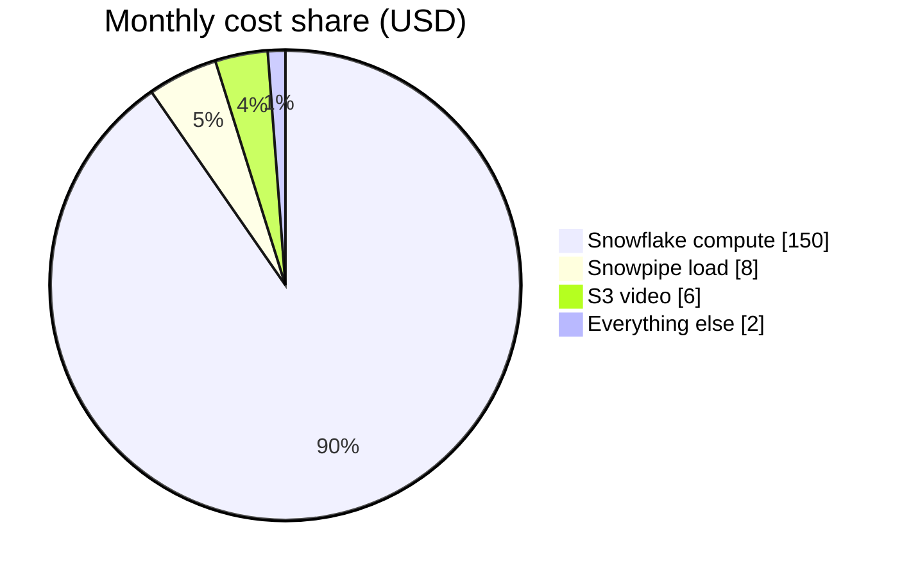

# 05 - Cost estimate

**Bottom-up monthly estimate for the reference AWS + Snowflake implementation at today's scale (2 edge devices), with a path to the ~20-device headroom.**

- Graded on stated assumptions and checkable arithmetic, not a precise figure — math is in-line and every assumption labeled.
- All prices are us-east-1 list, looked up July 2026; sources at the bottom.
- Free-tier credits are not priced as a discount — I note where they zero a line out but cost the architecture as if it stood on its own.

## Assumptions

These restate volumes from the shared context — assumptions, not measured facts, and each made easy to challenge.

- **Fleet:** 2 edge devices today (device 1 = 3 cameras on a Jetson; device 2 = 1 camera + 2 motion sensors on a Pi + Coral). 4 cameras total. Design headroom to ~20 devices.
- **Detection events:** ~200 person/PPE events per camera per day, motion-gated → ~**800/day** fleet-wide → ~24,000/month.
- **Motion signals:** ~**2,000/day** fleet-wide → ~60,000/month.
- **Telemetry heartbeat:** every 30–60 s per device. I use a 45 s average → ~1,920 msgs/device/day → ~3,840/day for 2 devices → ~**115,000/month**.
- **Total cloud ingest:** ~24k + 60k + 115k ≈ **~200,000 messages/month** (call it 0.2M).
- **Video:** 720p H.264, motion-gated clips, ~**3 GB/device/day** → 6 GB/day for 2 devices. Retained **30 days hot** (S3 Standard), then archived (Glacier Deep Archive), metadata row stays in Snowflake forever.
- **Users:** 10 users, light dashboard traffic. One customer, single tenant today.
- **Embeddings:** one 512-dim float32 vector per detection event (~2 KB) stored in Snowflake VECTOR column. Below Firehose's 5 KB metering floor, so it rides inside the event record.
- **Snowflake:** X-Small warehouse (1 credit/hour), Standard edition on AWS, 60 s auto-suspend + auto-resume. I assume it runs only for micro-batch loads and dashboard queries, **~2.5 hours/day** of active time. Storage is tiny because raw video never enters Snowflake — only structured events, telemetry, and pointers, which compress to a few GB.
- **Region:** single region us-east-1. No cross-region replication priced (DR is a named limitation elsewhere).

Most sensitive levers: video GB/day and Snowflake warehouse hours/day — both flagged below.

## Per-service monthly table

| Service | Unit price (us-east-1, Jul 2026) | Usage math | Monthly $ |
|---|---|---|---|
| AWS IoT Core — messaging | $1.00 / million msgs | 0.2M msgs × $1/M = $0.20 | $0.20 |
| AWS IoT Core — connectivity | $0.08 / million conn-minutes | 2 devices always-on × 43,200 min = 0.0864M × $0.08 | $0.01 |
| AWS IoT Core — rules + actions | $0.15 / million each | ~0.2M rules + ~0.2M actions = 0.4M × $0.15/M | $0.06 |
| AWS Lambda — requests | $0.20 / million (1M free) | ~0.1M invocations (per-event handlers) → within free tier | ~$0.00 |
| AWS Lambda — compute | $0.0000166667 / GB-s (400k GB-s free) | 256 MB × 150 ms × 0.1M = ~3,750 GB-s → within free tier | ~$0.10 |
| Amazon SNS — mobile push | $0.50 / million (1M free) | ~9,000 push/month (debounced alerts) → within free tier | ~$0.00 |
| Amazon SES — email | $0.10 / 1,000 emails | ~5,000 alert emails × $0.10/1k | $0.50 |
| S3 Standard — hot video | $0.023 / GB-month | 6 GB/day × 30-day rolling window = 180 GB × $0.023 | $4.14 |
| S3 Glacier Deep Archive — cold video | $0.00099 / GB-month | ~1.1 TB early archived history × $0.00099/GB (grows ~$0.18/mo) | ~$1.50 |
| Kinesis Data Firehose — ingest | $0.029 / GB (5 KB min/record) | 0.2M records × 5 KB ≈ 1.0 GB × $0.029 | ~$0.05 |
| Amazon Cognito — MAU | Essentials $0.015/MAU, 10k free | 10 users → within free tier | $0.00 |
| DynamoDB — on-demand (device state) | $1.25/M writes, $0.125/M eventual reads | ~0.2M shadow writes ($0.25) + ~1M reads ($0.13) | ~$0.40 |
| Snowflake — storage | $23 / TB-month (on-demand list) | ~5 GB compressed structured data = 0.005 TB × $23 | ~$0.12 |
| Snowflake — warehouse compute | $2.00 / credit; XS = 1 credit/hour | 2.5 h/day × 30 = 75 credits × $2 | $150.00 |
| Snowflake — Snowpipe / serverless load | ~$2/credit, per-file + load compute | micro-batch loads of ~0.2M events/month | ~$8.00 |
| **Total** | | | **~$165/month** |

Rounding across warehouse-hour and archive-growth uncertainty, I quote this as **roughly $150–200/month at current scale**.

## Snowflake, computed two ways

Snowflake splits into a near-free storage line and a compute line that dominates everything else.

- **Storage:** raw video stays out by design — only structured events, telemetry, embeddings, and S3 pointers land here. Compresses hard; ~5 GB even carrying history → 0.005 TB × $23/TB-month ≈ **$0.12/month**. Never a cost problem at this scale.
- **Compute:** XS warehouse = 1 credit/hour, Standard = $2.00/credit on AWS; 60 s auto-suspend means we pay only for active seconds. At ~2.5 h/day for micro-batch loads plus dashboard queries: 2.5 × 30 = 75 credits × $2.00 = **$150/month**.
- **Sensitivity:** entirely the hours/day figure — 2 h/day ≈ $120, 3 h/day ≈ $180. Auto-suspend is the single most important cost control in the design.

## Headline

**At this scale the bill is two lines: Snowflake warehouse compute (~$150) and S3 video (~$5–6); everything else is rounding error.**

- **IoT plumbing is cents.** IoT Core, Lambda, SNS, Firehose, Cognito, DynamoDB together are well under a dollar a month — most inside the free tier.
- **The two lines that matter.** Snowflake warehouse compute (dominant today at ~$150) and S3 video storage (small now at ~$5–6, but grows fastest with devices and retention).
- **Optimize exactly those two.** Aggressive video tiering (30 days hot in S3 Standard → Glacier Deep Archive, where 1 TB is ~$1/month) and an XS warehouse with 60 s auto-suspend so we pay for query/load time, not idle.
- Shaving IoT message cost optimizes a rounding error; warehouse scheduling and video lifecycle are where the money is.

## How this scales to ~20 devices

Growth is near-linear on the two lines that matter, near-flat on the rest.

- **Video (S3):** ~10× devices ≈ ~10× footage. Hot tier climbs ~180 GB → ~1.8 TB (~$41/month); archive grows ~$1.80/month faster but stays cheap via Deep Archive. Becomes the largest *storage* line.
- **Ingest (IoT Core / Firehose / Lambda / DynamoDB):** ~10× messages from a base of cents — still only a few dollars a month at 20 devices, much of it in the free tier.
- **Snowflake compute:** loads scale with ingest, but query concurrency is the bigger driver. If dashboard/analytics load pushes the XS past comfortable concurrency, step up to a **Small** (2 credits/hour) rather than run XS hot all day — a Small at the same ~2.5 h/day is ~$300/month. That step-up, not device count, moves the total.

Net: at ~20 devices, low-to-mid hundreds per month, still dominated by Snowflake compute with video storage the clear number two.

## Biggest cost risk

The largest risks are operational, not architectural, and both are guarded the same way.

- **Snowflake warehouse left running 24/7** (auto-suspend disabled, or a runaway query/streaming task holding it open): XS continuous = 720 credits ≈ **$1,440/month**, ~10× the intended bill; a Small doubles that.
- **Video tiering disabled or misconfigured**, so clips pile up in S3 Standard instead of aging into Glacier Deep Archive: at 20 devices that's ~$40 vs ~$500+/month for the same footage.
- **Guardrails:** enforce the S3 lifecycle policy and warehouse auto-suspend as code; alert on warehouse credit burn and on S3 Standard bytes exceeding the 30-day rolling window.

## Reproducing this in the official calculators

I did not want this to be a number you have to take on faith, so here is exactly how
to rebuild it in the vendors' own tools.

**AWS Pricing Calculator** (<https://calculator.aws>) - add these services and inputs
(us-east-1). Everything here lands in cents or the free tier, which is the point:

| Service to add | Inputs to enter | Expected |
|---|---|---|
| AWS IoT Core | ~0.2M messages/month; 2 things connected 24/7; ~0.4M rules+actions | ~$0.30 |
| AWS Lambda | ~0.1M requests, 256 MB, ~150 ms avg | free tier (~$0.10) |
| Amazon SNS | ~9k mobile push/month | free tier |
| Amazon SES | ~5k outbound emails/month | ~$0.50 |
| Amazon S3 | Standard: 180 GB-month; Deep Archive: ~1.1 TB; a few thousand PUT/GET | ~$5-6 |
| Kinesis Data Firehose | ~1 GB/month ingested (5 KB min record) | ~$0.05 |
| Amazon Cognito | 10 monthly active users | free (10k MAU free) |
| Amazon DynamoDB | on-demand, ~0.2M writes + ~1M reads | ~$0.40 |

Add them and the AWS side totals **under ~$8/month**. The calculator produces a
shareable estimate URL you can attach to a submission; the inputs above are what I
would enter to generate it.

**Snowflake** is not in the AWS calculator - price it from Snowflake's own pricing
page (<https://www.snowflake.com/pricing/>), which is credit-based:
- Storage: compressed structured data (no video) at ~$23/TB-month on-demand. At ~5 GB
  that is ~$0.12/month.
- Compute: `credits = warehouse_size_credits_per_hour x active_hours x days`. For an
  X-Small (1 credit/hour) at ~2.5 h/day for 30 days: `1 x 2.5 x 30 = 75 credits`, and
  at $2.00/credit (Standard on AWS) that is **$150/month**. Change only the
  hours/day to see the whole total move - that is the one lever that matters.

Put together, the official-calculator rebuild lands in the same place as my table:
**roughly $150-200/month**, dominated by the Snowflake warehouse.

## Price sources (looked up July 2026, us-east-1)

- AWS IoT Core — $1.00/M messages, $0.08/M connection-minutes, $0.15/M rules & actions: <https://aws.amazon.com/iot-core/pricing/>
- AWS Lambda — $0.20/M requests, $0.0000166667/GB-s (x86), 1M req + 400k GB-s free: <https://aws.amazon.com/lambda/pricing/>
- Amazon SNS — mobile push $0.50/M after 1M free: <https://aws.amazon.com/sns/pricing/>
- Amazon SES — $0.10 per 1,000 emails: <https://aws.amazon.com/ses/pricing/>
- Amazon S3 — Standard $0.023/GB-month; Glacier Deep Archive $0.00099/GB-month: <https://aws.amazon.com/s3/pricing/>
- Amazon Data (Kinesis) Firehose — $0.029/GB ingested, 5 KB metering increments: <https://aws.amazon.com/firehose/pricing/>
- Amazon Cognito — Essentials $0.015/MAU, first 10k MAU free: <https://aws.amazon.com/cognito/pricing/>
- Amazon DynamoDB — on-demand $1.25/M writes, $0.25/M strongly-consistent reads ($0.125/M eventual): <https://aws.amazon.com/dynamodb/pricing/on-demand/>
- Snowflake — Standard edition $2.00/credit on AWS; XS warehouse = 1 credit/hour; storage $23/TB-month on-demand list: <https://www.snowflake.com/en/data-cloud/pricing-options/>

Note on confidence: the AWS IoT Core figures were confirmed directly from the AWS pricing
page on the date above. The remaining AWS unit prices are stable, long-standing list rates
that I cross-checked against current pricing summaries in July 2026; if any has shifted, the
effect on the total is negligible because those lines are all under a dollar. The one number
that carries real weight is the Snowflake credit price ($2.00/credit, Standard on AWS) — I
treat that as the assumption most worth re-confirming, since the whole total pivots on the
warehouse compute line.
