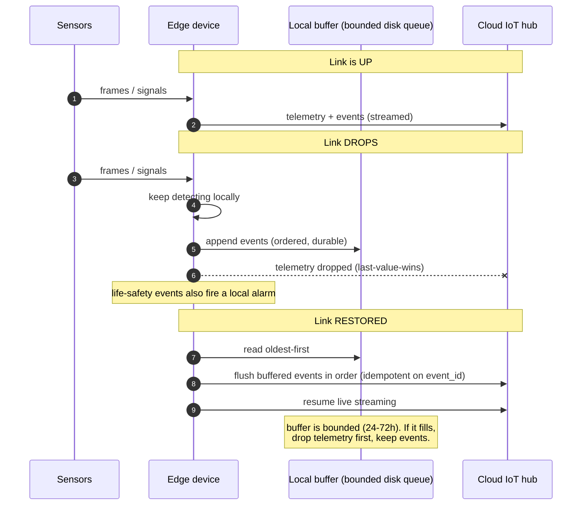

# 06 - Trade-offs and failure modes

**What breaks, why I chose what I chose, and where this design stops working - named before the architect names them.**

## What happens when the internet drops

**The failure mode the brief named directly. Answer (non-negotiable #2): the edge keeps working.**

- **Detection continues.** Inference runs locally, so a link outage degrades
  reporting, not safety. The cloud is for aggregation, never for real-time control of
  a safety event.
- **Events are durable and ordered; telemetry is droppable.** Events buffer to a
  bounded disk queue and flush in order on reconnect, deduped by `event_id`.
  Telemetry is last-value-wins - a gap in the CPU-temperature series does not matter,
  a missed PPE violation does. When the buffer fills (I size it for 24-72h), telemetry
  is dropped first and events are kept.
- **Life-safety has a local path.** Fire triggers a local alarm at the edge in < 1 s,
  independent of the WAN. A life-safety event that depends on the internet is a design
  bug.
- **The dashboard tells the truth.** A device is shown "stale/offline" only after
  missed heartbeats, not on the first miss, so a flaky link does not flap the UI.

## Why these services, and what would flip the choice

One line each, with the condition that would change my mind.

| Decision | Why | What would flip it |
|---|---|---|
| AWS IoT Core over self-managed MQTT | Managed device identity, rules, and shadows; no broker to run for a 2-device fleet | A hard requirement to avoid a specific cloud, or a fleet large enough that broker economics beat the managed premium |
| Snowflake over a Postgres warehouse | It is the requirement, and `VARIANT` + `VECTOR` are exactly the future-proof and similarity features I need | A need for sub-second operational queries (that is an OLTP store's job, not a warehouse's) |
| Lambda over containers | Traffic is spiky and low-volume; per-request billing is near-free at this scale | Sustained high throughput, or a handler that needs long-lived state or >15 min runtime |
| SNS/SES over a third-party (Twilio, etc.) | Already inside the stack, cheap, good enough for push + email | A need for rich SMS/voice deliverability or global carrier routing |
| Kinesis Firehose + Snowpipe over direct writes | Decouples ingest spikes from the warehouse and batches loads efficiently | If micro-batch latency ever needs to drop below what Snowpipe streaming offers |
| Embeddings in Snowflake `VECTOR` over a dedicated vector DB | One system to operate; exact kNN is fast enough here | Vector count past ~1M or a hard <300 ms search SLA (then add an ANN index) |

## Limitations I am choosing to accept

**Naming them is the point; hiding them is the tell.**

| Limitation | Why I accept it | Deferred upgrade / trigger |
|---|---|---|
| Single region (`us-east-1`) | The edge survives an outage and buffers, so detection and safety keep working | Multi-region when an availability SLA demands it |
| Glacier retrieval is minutes-to-hours | Fine for "all history"; the last 30 days stay in S3 Standard for live review. ~20x saving on cold video | Keep more in Standard if instant old-video review is needed (and pay) |
| Built for 10 users, not 10,000 | XS warehouse, row-policy subquery, and exact-kNN scan are all fine here | Breaks first at: warehouse size, then the RAP join, then the vector scan |
| On-device accuracy bounded by hardware | Pi + Coral runs lighter models than a Jetson; the fleet is heterogeneous by design | Bigger accelerator / Jetson per [`02-edge-research.md`](02-edge-research.md) |
| Similarity is not identity | Cosine finds look-alikes, never a biometric match; identity data stays masked | N/A - a deliberate boundary |

## The non-negotiables, restated

The boundaries I set for myself and would defend in the room - each costs a little now and saves a lot later:

1. Raw video never enters Snowflake - S3 holds bytes, Snowflake holds metadata + pointers.
2. The edge keeps working when the link drops.
3. No PII in analytics tables without a masking policy.
4. Algorithm and firmware pushes are staged and reversible - canary, rollout, rollback.
5. Every layer boundary is versioned - old and new firmware both keep speaking to the cloud.
