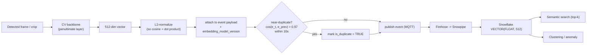

# 07 - Semantic search and similarity

**Turn each detection into a vector, then use one piece of math - cosine similarity -
to search by meaning, suppress noise, and surface the unusual.** This is the analytics
and modelling edge on top of the schema. Kept deliberately simple: a clear, defensible
approach, not a research paper.

## The one idea everything rests on

- Give every detection an **embedding** (a fixed-length vector of what it looks like).
- Compare two events by the **angle** between their vectors. Similar events point the same way.

Cosine similarity is that angle, in `[-1, 1]`:

```
                 a . b            sum(a_i * b_i)
cos(a, b) = --------------- = -----------------------
             ||a||  ||b||       ||a||       ||b||
```

**The key decision: store L2-normalized vectors** (`||a|| = 1`). Then:

```
cos(a, b) = a . b               (dot product)
||a - b||^2 = 2 - 2 cos(a, b)   (smaller distance <=> larger cosine)
```

- Cosine, dot product, and Euclidean distance all agree on the ranking.
- So I use **one metric everywhere** - search, dedupe, clustering. That is the single
  simplification the whole subsystem leans on.

### Why cosine, not the alternatives

| Metric | Problem | Verdict |
|---|---|---|
| Raw dot product | Rewards long vectors; a high-confidence hit scores "more similar" just for magnitude | Normalize length away |
| Euclidean (un-normalized) | Mixes direction and length; after L2-norm it is just a function of cosine anyway | Nothing to gain |
| **Cosine** | Compares direction only = "do these look like the same thing"; Snowflake ships `VECTOR_COSINE_SIMILARITY` | **Chosen** |

## Where the vectors come from



- **Computed at the edge**, reusing the detector backbone (penultimate layer) - near-zero
  extra cost, and the cloud only ever stores vectors, never pixels.
- Lands in a `VECTOR(FLOAT, 512)` column on `detection_event` + an `embedding_model_version` tag.
- **512 dims** is the middle: enough to separate "person" / "person without hard hat" /
  "forklift"; small enough that a vector is ~2 KB and a month-long scan is trivial.

## The three features at a glance

| Feature | What it does | Math | Key parameter |
|---|---|---|---|
| Semantic search | "Show me events like this" | exact k-NN by cosine | top-k = 10, 30-day window |
| Near-dup suppression | Collapse a flickering detector's repeats | `cos(e_t, e_{t-1}) > tau` in window `W` | `tau = 0.97`, `W = 10s` |
| Anomaly / clustering | Group the usual, flag the novel | k-means; `1 - max cos(e, centroid)` | anomaly threshold |

### Feature 1 - Semantic incident search

Exact k-nearest-neighbours: score every candidate, keep the best k.

```sql
SELECT event_id, device_id, event_type, ts, confidence,
       VECTOR_COSINE_SIMILARITY(embedding, :q) AS similarity
FROM EDGEIOT.EVENTS.detection_event
WHERE ts >= DATEADD(day, -30, CURRENT_TIMESTAMP())
  AND NOT is_duplicate
  AND embedding IS NOT NULL
ORDER BY similarity DESC
LIMIT 10;
```

- **Why exact, not ANN:** cost is `O(n*d)`; at ~1e4-1e5 vectors in the hot month a scan
  is milliseconds and always returns the true top-k.
- **Crossover to an ANN index (HNSW/IVF):** vector count past ~1M, or scan p95 > 300 ms.
  Until then an index is complexity I cannot justify.

### Feature 2 - Near-duplicate / debounce suppression

- **Failure mode:** a person in view for 8 s makes a naive detector emit 200 near-identical
  events -> 200 alerts, 200 rows. Real problem.
- **Fix:** two consecutive same-sensor detections are one incident if
  `cos(e_t, e_{t-1}) > tau` and within `W` seconds. Runs at the edge (compare to the last
  embedding in memory), so duplicates never leave the device.
- **Tuning `tau = 0.97`** (start point, calibrate on labelled data):

| Threshold | Effect | Risk |
|---|---|---|
| Too high (0.99) | Only identical frames merge | Dupes leak -> alert storm |
| Too low (0.90) | Distinct events merge | **Dropped real incident (dangerous)** |

- I bias slightly high: extra noise is safer than a dropped incident. Fire is never suppressed.
- Audit view `v_duplicate_candidates` (in `04_privacy_and_views.sql`) verifies and tunes it.

### Feature 3 - Anomaly detection and clustering

- **What:** group recurring event types, flag the unusual - the "modelling" ask, no labels needed.
- **Math:** cluster normalized embeddings (k-means = spherical k-means on unit vectors = cosine).

```
anomaly(e) = 1 - max_j cos(e, c_j)      # 0 = known cluster, ->1 = novel
flag if anomaly(e) > threshold
```

- High score = "not like anything we usually see here": a new PPE-violation type, an odd
  object, a drifted camera.
- Clusters give the dashboard a free vocabulary ("3 events in 'forklift near pedestrian'
  this week") with no hand-labelling.

## Edge cases the architect will (rightly) poke

| Edge case | Handling |
|---|---|
| Cold start (no events) | Degrade to metadata filters (time, device, event_type); never block the UI |
| Embedding-model drift | Cosines compare only **within one version**; every row carries `embedding_model_version`, filter to one, re-embed backfill on model promotion |
| Exact vs ANN crossover | Stay exact until ~1M vectors or p95 > 300 ms, then add an ANN index |
| Normalization discipline | Normalize at the edge; one un-normalized vector corrupts rankings, so it is a fixed step |
| Similarity != identity | Cosine says "looks alike", not "same person"; never a biometric match; identity data stays behind masking ([`04`](04-snowflake-data-model.md)) |

## Why this is the right amount of engineering

One metric, one column, one native function, one normalization step -> three features
(search by meaning, ingest-time noise filter, label-free anomaly detection). No extra
vector database, no ANN index I do not yet need. Simple enough to explain in a sentence,
and it scales to an ANN index the day the numbers say so.
