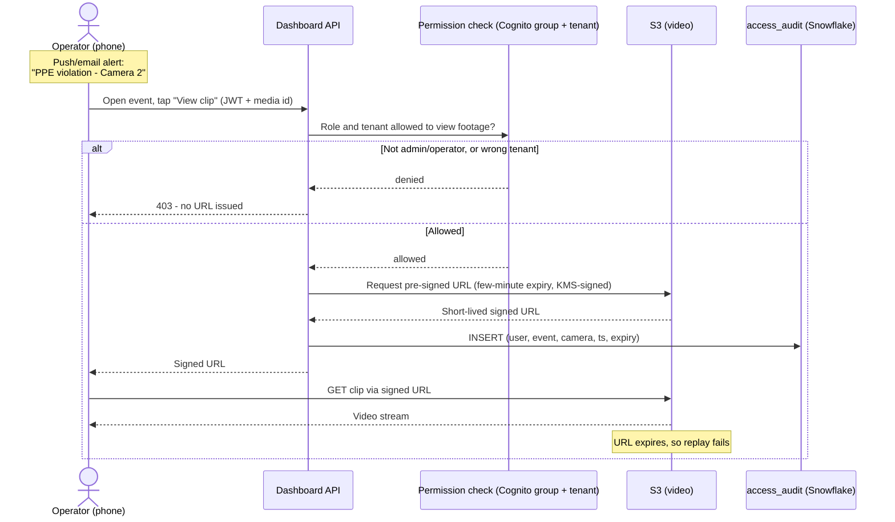

# 09 - User experience

The other end of the wire: a person at a desk or on a phone trying to get something done. If nobody can answer "did that alert happen, and can I see the clip without leaking someone's face," the design has failed at the only layer the customer touches.

## In plain English

**A single site ops team of ~10 who check in on the platform rather than babysit it - a couple of operators on the floor during business hours, an occasional viewer, an auditor now and then, one or two admins.**

- They come to answer four questions: **are my devices healthy, did anything happen I need to act on, can I find something later, and who has been looking at camera footage.**
- Privacy is the thread: most people can see *that* an event happened without seeing *who* was in the frame. Camera access is the privileged, audited exception, not the default.

## The four roles, in practice

**Four roles - admin, operator, viewer, auditor - each mapped to a Cognito group on the way in and a Snowflake role on the way to the data, so the same permission is enforced twice (API and warehouse).** A bug or a hand-written query cannot bypass the rules the UI shows.

Who can do what, and - more importantly - what each role **cannot** do:

- **Admin** - runs the account. Manages users, sees everything an operator sees, views unmasked footage. Smallest group (one or two) by design, because unmasked access should stay rare.
- **Operator** - runs the floor. Configures devices/alerts, pushes algorithms, acknowledges alerts, and - since responding to a safety event requires seeing the frame - views live feeds and unmasked clips. The working role during business hours.
- **Viewer** - watches the numbers. Device status, telemetry, and that events occurred, but **no live camera and no unmasked footage**: knows "PPE violation on camera 2 at 09:14" without a video link or identifying attributes. Default seat for most of the ten.
- **Auditor** - watches the watchers. Read-only, PII masked like a viewer, plus one power that is their job: reading the **access-audit trail** (who viewed which camera data, when). Cannot push, manage users, or pull unmasked footage - oversight, not operation.

### Permissions matrix

`allowed` = full access, `masked` = the action returns a result but identifying /
camera content is redacted, `denied` = the action is refused outright.

| Capability | Admin | Operator | Viewer | Auditor |
|---|---|---|---|---|
| View device status + telemetry | allowed | allowed | allowed | allowed |
| View that an event occurred (metadata) | allowed | allowed | allowed | allowed |
| View live camera feed | allowed | allowed | denied | denied |
| View historical clip / footage | allowed | allowed | denied | denied |
| View unmasked event attributes (identity-bearing) | allowed | allowed | masked | masked |
| Run semantic / event search | allowed | allowed | allowed (masked results) | allowed (masked results) |
| Configure alert / notification rules | allowed | allowed | denied | denied |
| Push / roll back detection algorithm | allowed | allowed | denied | denied |
| Manage users and roles | allowed | denied | denied | denied |
| Read access-audit trail | allowed | denied | denied | allowed |

**The `masked` and `denied` cells are not UI politeness - they are the Snowflake policies from [`04-snowflake-data-model.md`](04-snowflake-data-model.md) doing their job.**

- **Dynamic masking policy** on the S3 media pointer and identity-bearing `attributes` VARIANT turns "view footage" and "unmasked attributes" into `masked` for viewer/auditor: they query `detection_event` freely but get a redacted pointer and null identity unless the session role is `EDGEIOT_ADMIN`/`EDGEIOT_OPERATOR`. Redaction happens inside the warehouse, below the query.
- **Row-access policy** (`device_tenant_isolation`) scopes every row to the caller's tenant. One tenant today, so a no-op - but viewer/auditor are already tenant-safe the day a second customer arrives, no query rewrite (non-negotiable #5).
- **Cognito group** on the JWT is checked first, before Snowflake: the API refuses `denied` actions up front (no data round-trip); warehouse policies are the backstop if someone reaches the data another way.

Each capability is gated in two independent places that agree - privacy-first means "provably enforced," not "enforced by the frontend."

## Core user journeys

**Five walk-throughs - the simple front hides the careful back, so each carries its behind-the-scenes note.**

| Journey | Steps | Behind the scenes |
|---|---|---|
| **a. Operator morning check** | 1. Maria (operator) logs in via Cognito; JWT carries the `operator` group. 2. Lands on **Fleet**: Jetson (3 cameras) green, heartbeat 12s ago; Pi + Coral amber, heartbeat 4 min ago. 3. Clicks the Pi - telemetry (temps, FPS, store-and-forward queue depth) flat-lines after 09:02, queue depth climbing, so it is alive and buffering, not dead: the WAN link dropped. 4. Notes it; because events are durable on reconnect (non-negotiable #2) nothing is lost, she moves on. | Status/telemetry come from the device shadow (last-known state) and the hot telemetry table, refreshed on a 1-5s WebSocket/poll. "Stale" is just "now minus last heartbeat exceeds threshold" - amber then offline, no special alert plumbing. Telemetry is last-value-wins and droppable, so an outage gap is expected and pages no one. |
| **b. Responding to a PPE-violation alert** | 1. Phone buzzes: push "PPE violation - Camera 2 - 09:14," email as fallback. 2. Taps it - **event detail**: type, camera, confidence, timestamp, thumbnail placeholder. 3. Taps "View clip" - backend confirms operator role, issues a short-lived signed URL to the S3 clip, player loads. 4. Confirms it is real, acknowledges, event marked handled. | The moment the URL issued, a row was written to `access_audit` (user, event, camera, timestamp, expiry). The URL lives a few minutes then dies. As a viewer, step 3 returns `denied` and no URL exists. This is the flow the sequence diagram below traces in full. |
| **c. Semantic search / investigation** | 1. Near-miss reported (forklift too close to a person on foot, last Tuesday afternoon); Maria opens **Search**. 2. Types "forklift near a person on the dock," or opens a similar event and clicks "show me events like this." 3. Gets a ranked list - closest first - across the last 30 days with time, camera, similarity score. 4. Scrubs the top five, finds the Tuesday clip (operator, so footage opens), exports the event reference for the incident report. | Cosine top-k search from [`07-semantic-search-and-similarity.md`](07-semantic-search-and-similarity.md): query embedded into the same 512-dim space and ranked by `VECTOR_COSINE_SIMILARITY` over the hot window, well under the 300 ms target. As a viewer, ranking still works (search is open to all) but footage links and identity come back masked. Opening a clip is the same audited signed-URL path as (b); ranking issues no URLs, only opening one does. |
| **d. Pushing a new detection algorithm** | 1. Better hard-hat model; Maria opens **Models**, uploads the artifact, backend stores it in S3 and records the checksum. 2. Starts a **staged rollout**: canary first (the Pi), status card flips `pending` -> `downloading` -> `verifying` (checksum match) -> `active`. 3. Lets the canary run, watches event rate and confidence vs the old model - healthy. 4. Promotes to the fleet; the Jetson picks it up the same way. 5. Two hours later the Jetson's false-positive rate spikes; hits **Roll back**, fleet reverts to the known-good version on the next job poll. | IoT Jobs driving the canary -> fleet rollout from [`03-cloud-controlplane.md`](03-cloud-controlplane.md), with checksum verify and one-click revert (non-negotiable #4). The dashboard is just a view onto per-device job state; staging and reversibility live in the control plane. Only admin and operator reach this screen. |
| **e. Auditor review** | 1. Quarter-end; Sam (auditor) logs in, JWT carries the `auditor` group. 2. Opens **Audit**, filters the trail: "all camera-footage views, last 90 days, camera 2." 3. Gets a table - who issued a signed URL, for which event/camera, when, and when it expired; sees only operators and one admin ever opened footage, never outside business hours. 4. Exports it for the compliance file. At no point could Sam open that footage - his own role masks it. | The trail is `access_audit`, written by every signed-URL issue and every search. The auditor's read is itself a normal query under the masking and row policies, so oversight is bounded by the same rules. "Privacy-first" means access is **provable after the fact** - and the person proving it cannot use the proof as a back door. |

## What each main screen does

Seven screens. Plain-English purpose, and which roles even see the tab.

| Screen | What it does, in one line | Who sees it |
|---|---|---|
| **Fleet / status** | Health of every device - online/stale/offline, last heartbeat, firmware. | all roles |
| **Live / feeds** | Live camera streams for the site. | admin, operator |
| **Events / alerts** | The stream of detections and alerts; open one to see detail and (if allowed) the clip; acknowledge. | all roles (footage masked for viewer/auditor) |
| **Search** | Semantic and text search over recent events; "show me events like this." | all roles (results masked for viewer/auditor) |
| **Models / rollouts** | Upload an algorithm, run a staged rollout, watch status, roll back. | admin, operator |
| **Admin / users** | Create users, assign roles, deactivate accounts. | admin |
| **Audit** | The access-audit trail: who viewed which camera data and when. | admin, auditor |

Hiding a tab is cosmetic - the real gate is the Cognito group check plus the Snowflake policies. A viewer hand-crafting a request to the models endpoint is rejected on the group claim before anything happens.

## How camera-data access actually works

**Nobody ever gets a permanent link to video - every allowed view mints a one-time, few-minute pass tied to the person, logs it, and lets it expire. No public URL to leak, forward, or bookmark.**

Step by step, when a user clicks "View clip":

1. **Request.** The dashboard calls the backend API with the user's JWT and the event/media id.
2. **Permission check.** Backend reads the Cognito group and tenant from the token; role must be admin/operator and the media must belong to the caller's tenant. Fail either and it returns `denied` - no URL created.
3. **Short-lived signed URL.** On success, S3 issues a pre-signed URL for exactly that object, valid a few minutes, signed with a KMS key; returned to the browser, which plays the clip directly from S3.
4. **Audit write.** Same handler, before returning, inserts an `access_audit` row: user, event, camera/media id, timestamp, expiry. This is what journey (e) reads.
5. **Expiry.** Minutes later the URL is dead - replaying or sharing gets an S3 error. Watching again is a fresh request and a fresh audited event.

**Why signed and short-lived, never public.** A public or long-lived URL is a standing liability: anyone who obtains it has the footage forever, with no record of who looked. Short-lived signed URLs grant access per-view, per-person, every grant logged; they also keep S3 private (no public bucket) and put the permission decision in code, not bucket ACLs. The cost - the frontend asks each time - is trivial for a ten-person, low-concurrency site.

## Assumptions about usage

**These shape the UX and backend sizing - a senior reviewer should be able to push on each.**

- **~10 users, one customer.** The ten named users in `app_user`, one tenant. Grow to many tenants and nothing in the UX changes, but the row-access policy stops being a no-op and does real isolation - which is why it is already there.
- **Business-hours-heavy, low concurrency.** Floor watched during working hours, dashboard idle overnight/weekends. No hundreds of concurrent live streams; a handful of viewers and the odd search is peak. 24/7 or highly concurrent usage would revisit the WebSocket fan-out and BI warehouse sizing, not the screens.
- **A few operators live, occasional viewers/auditors.** One or two operators active at a time, everyone else dipping in - why the operator seat is richest and unmasked access is concentrated there.
- **Mobile for alerts, desktop for investigation.** Alerts on a phone (push + email, glanceable, tap to acknowledge); search, clip comparison, and rollout on a desktop. Event-detail/acknowledge work on a phone; Search and Models assume a larger window. Full mobile investigation is a frontend layout effort, not an architecture change.
- **Freshness matches the tiers.** Device status/telemetry near-real-time (1-5s), analytics/search reflect the last minute or two (Snowflake micro-batch). No control loop runs through the dashboard; safety-critical response lives at the edge.

Through-line: a small, trust-heavy, privacy-sensitive deployment, not a consumer product at scale - few screens, sharp roles, camera access as the rare, logged exception.

## Journey (b), as a sequence

The alert-to-clip-review flow, end to end, showing the permission check and the
audit write that make it privacy-first:

That single diagram is the whole privacy posture in miniature: a view is a request,
a request is checked, a grant is short-lived, and every grant is written down.
