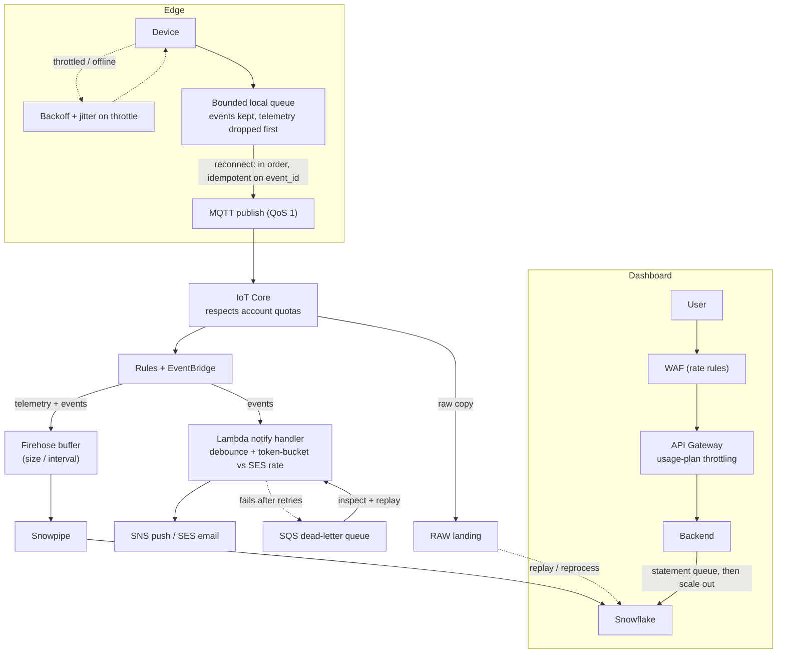

# 10 - Production engineering: limits, queues, concurrency, resilience, security

This document answers a fair question directly: is this a slide-deck architecture,
or would it survive contact with production? It pulls together the cross-cutting
concerns that are easy to hand-wave - rate limits, queues, parallelism, idempotency,
error handling, the actual algorithms in play, and security - and says exactly how
each is handled, or deliberately deferred.

**In plain English:** every place that can get overloaded has a queue in front of it
and a defined behaviour when it backs up; every message can be safely retried
without creating duplicates; every failure has somewhere to land and a way to
replay; and every piece of camera data is authenticated, encrypted, and audited.
Where I chose *not* to build something yet, I say so and give the trigger that would
change my mind.

## 1. Delivery guarantees and idempotency (the backbone)

Everything else rests on this. The transport is **at-least-once** (MQTT QoS 1), so a
device that loses the link and retries *will* send some events twice. I make that
safe rather than trying to prevent it:

- Every event carries a client-generated **`event_id`** (an idempotency key).
- Loads use **`MERGE` (upsert) keyed on `event_id`**, not blind `INSERT`, so
  reprocessing the same message is a no-op. At-least-once transport + idempotent
  writes gives **effectively-once** results without distributed transactions.
- **Ordering** is per-sensor by event time (`ts`); the edge buffer flushes
  oldest-first so a reconnect replays in order.
- The **RAW landing table is the replay log**: if a downstream transform has a bug,
  I fix the Task and reprocess from RAW rather than asking devices to resend.

## 2. Rate limiting and throttling

Every external boundary has a limit; the design respects each one at the right layer.

| Boundary | The limit | How the system respects it |
|---|---|---|
| Device -> IoT Core | Per-account message / connection quotas | Devices back off with **exponential backoff + jitter** on throttle; telemetry is coalesced (last-value-wins) so a reconnect storm does not amplify |
| Notification handler -> SES/SNS | SES max send rate and daily quota | A **token bucket** in the Lambda paces sends; the **debounce/aggregate** step collapses repeat detections so we rarely approach the limit |
| Dashboard -> API | Abuse / accidental load | **API Gateway usage plans** (per-key rate + burst) and **WAF rate rules** in front; the backend never sees an unbounded request rate |
| Queries -> Snowflake | Warehouse concurrency | Statements **queue** on a busy warehouse (bounded by `STATEMENT_QUEUED_TIMEOUT`); if queuing hurts UX, `WH_BI` scales up or out (multi-cluster on Enterprise) rather than starving loads |
| Model/OTA push -> fleet | Blast radius, not a rate | **Staged rollout** (canary -> percentage -> fleet) is a deliberate rate limit on risk |

The theme: rate limiting lives **at the boundary that owns the limit**, and the
cheapest control (debounce, coalescing) runs first so we rarely hit the hard ones.

## 3. Queues and buffering (what queue, where, and why)

Queues are how a system absorbs spikes without dropping work or melting the thing
downstream. Each one here earns its place.

| Queue / buffer | Where | Why it exists |
|---|---|---|
| Bounded local disk queue | Edge | Survive a WAN outage (24-72 h); events durable and ordered, telemetry droppable first |
| MQTT topics (pub/sub) | IoT Core | Decouple device publish rate from consumer speed |
| Kinesis Firehose buffer | Ingest | Batch small event/telemetry records into efficient files for the warehouse; smooths spikes |
| Snowpipe internal queue | Load | Serverless, decoupled load; a backlog waits, it does not fail |
| Streams (change queues) | Snowflake | Hand a Task only the new RAW rows; incremental, no full re-scan |
| **SQS + dead-letter queue** | Notification / object handlers | Retries with backoff; a **poison message** that fails N times lands in the DLQ for inspection and replay instead of blocking the pipeline or being lost |

The DLQ is the piece a first draft usually forgets. Without it, one malformed event
can wedge a handler or vanish silently; with it, failures are visible, bounded, and
replayable.

## 4. Concurrency and parallelism

- **Edge.** Inference is **motion-gated** (do work only when a zone is active), and
  multi-camera nodes fan streams across the GPU (DeepStream/TensorRT batching). The
  Coral runs one stream comfortably. Parallelism here is about using the accelerator,
  not threads on a CPU.
- **Cloud.** Lambda scales horizontally per event; **reserved concurrency** protects
  the account and downstream services from a thundering herd, and **provisioned
  concurrency** removes cold starts on the notification path where the 5 s budget
  matters. Fan-out is native (EventBridge, SNS, Firehose shards).
- **Warehouse.** Snowflake is massively parallel by design - a query is split across
  the micro-partitions of a table. Separate warehouses (`WH_LOAD`, `WH_BI`,
  `WH_VECTOR`) give **workload isolation** so a heavy report cannot slow ingestion.

## 5. Error handling and resilience

| Concern | Mechanism |
|---|---|
| Transient failures | Retry with **exponential backoff + jitter** (avoids synchronized retry storms) |
| Poison messages | **Dead-letter queue** after a bounded retry count; alert + manual/automated replay |
| A dependency is down (e.g. SES) | **Circuit breaker** in the handler: stop hammering, queue, and drain when healthy |
| Slow/hung calls | Explicit **timeouts** on every network call; no unbounded waits |
| Duplicate work | **Idempotency** (event_id + MERGE), so retries are safe |
| Bad data / transform bug | **Replay from RAW** after fixing the Task; RAW is the source of truth |
| Edge disconnected | **Graceful degradation**: keep detecting, buffer, fire local safety alarms |
| Silent rot | **Heartbeats + CloudWatch alarms**; a device goes "stale" after missed beats, not on the first miss |
| Bad model rollout | **Canary + health gate + automatic rollback** |

## 6. Data structures and algorithms in play

The user asked specifically, so here they are, each tied to where it is used and why
that choice.

| Technique | Where | Why |
|---|---|---|
| **Cosine similarity / dot product** on L2-normalized vectors | Semantic search, near-dup | One metric for search, dedup, and clustering (see [`07`](07-semantic-search-and-similarity.md)) |
| **Exact k-NN** (brute-force scan) | "Events like this" | True top-k, milliseconds at this scale; **ANN/HNSW** is the documented next step past ~1M vectors |
| **k-means / spherical k-means** | Clustering, anomaly score | Label-free grouping; distance-to-centroid flags the unusual |
| **Sliding window** | Debounce, near-dup within W seconds | Bounds "the same incident" in time |
| **Token bucket / leaky bucket** | SES/SNS pacing, API throttling | Standard, fair rate limiting with burst tolerance |
| **Exponential backoff + jitter** | Reconnect, retries | De-correlates retries so a fleet does not reconnect in lockstep |
| **Bounded FIFO ring buffer** | Edge store-and-forward | Constant memory; drop policy (telemetry first) is explicit |
| **Hash set / (optional) Bloom filter** | Edge dedupe of seen `event_id`s | Cheap duplicate suppression before sending |
| **SHA-256 checksum** | Model/firmware integrity | Device verifies the artifact before swapping (supply-chain safety) |
| **Micro-partition pruning** | Snowflake time-window queries | Read only relevant partitions; the hot month stays fast over years of history |
| **Priority ordering** (events > telemetry) | Buffer flush, drop policy | Never lose a safety event to a backlog of temperatures |

I explicitly did **not** reach for consistent hashing, a Kafka cluster, or a
sharded vector database: at 2-20 devices they would be complexity without payoff.
Section 8 lists the triggers that would bring each one in.

## 7. Security (threat model and controls)

Security is designed in layers, not bolted on. The table pairs a concrete threat
with the control that addresses it.

| Threat | Control |
|---|---|
| A rogue or spoofed device | **Per-device X.509 certificates** (mutual TLS); one cert revoked in isolation, no shared secret |
| Stolen credentials on the dashboard | **Cognito** with MFA-capable auth; short-lived tokens; role in the token drives access |
| Eavesdropping in transit | **TLS everywhere** (device->cloud, browser->API) |
| Data theft at rest | **KMS** encryption on S3 and Snowflake; keys rotated |
| Over-broad access to footage | **Least-privilege IAM**, Snowflake **row-access + masking policies**, and **short-lived signed URLs** (never public links) |
| Insider / accountability gap | **`access_audit`** trail: who viewed which camera data, when - provable, not just restricted |
| Leaked secrets | **Secrets Manager** with rotation; nothing in code or env files |
| Compromised or tampered model | **Signed artifacts + SHA-256 verify on-device + staged rollout** with rollback |
| Fleet-wide security drift | **IoT Device Defender** monitors posture and flags anomalies |
| DoS / abuse of the public surface | **WAF + API Gateway throttling**; CloudFront absorbs edge load |
| Network exposure | Backend in **private VPC subnets**; only CloudFront/API Gateway are public |
| PII sprawl into analytics | **Masked by default**; identity data never enters analytics tables unmasked (non-negotiable #3) |

The one-line summary: **authenticate every actor, encrypt every hop, mask by
default, sign what you deploy, and audit every access to camera data.**

## 8. What I deliberately deferred, and the trigger to add it

Judgement is as much about what you leave out. Each of these is a known,
signposted upgrade, not an oversight:

| Deferred | Trigger to add it |
|---|---|
| ANN / HNSW vector index | Vector count past ~1M or search p95 > 300 ms |
| Multi-cluster warehouse | Sustained dashboard concurrency that makes statements queue |
| Multi-region / DR | An availability SLA the single-region design cannot meet |
| Kafka / MSK instead of Firehose | Ingest throughput or replay needs beyond Firehose + Snowpipe |
| Provisioned concurrency everywhere | Cold-start latency showing up outside the notification path |
| Sharding / consistent hashing | A single warehouse or table genuinely becoming a hotspot |

At 2-20 devices and 10 users, adding these now would be paying for scale that does
not exist. The value is knowing exactly where each line is.
